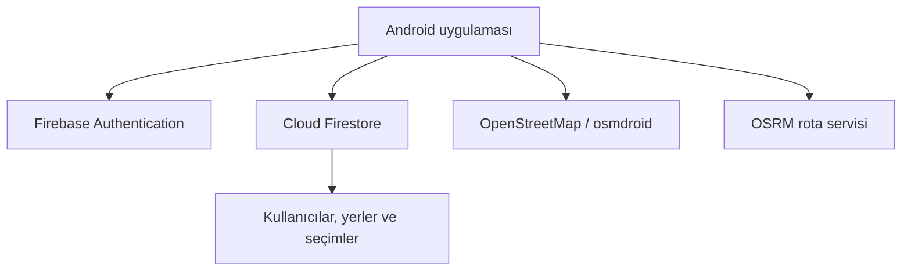
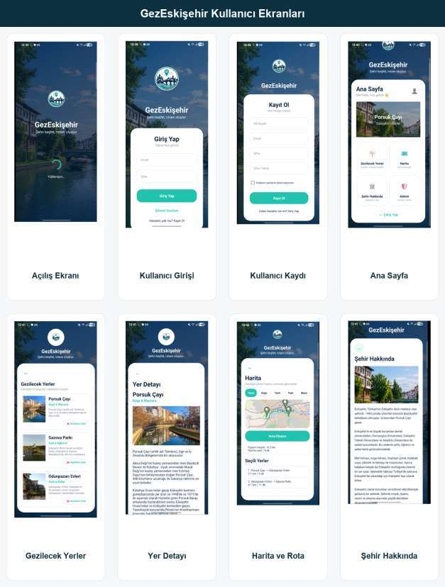
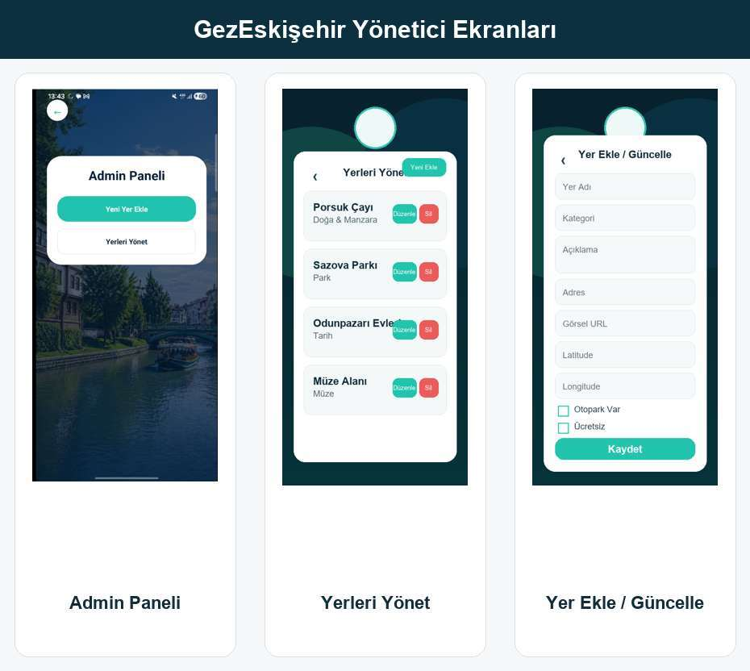

# GezEskişehir

GezEskişehir; Eskişehir'i keşfetmek isteyen kullanıcılar için geliştirilmiş, Java tabanlı bir Android şehir rehberi uygulamasıdır. Kullanıcılar turistik yerleri kategorilere göre inceleyebilir, kişisel gezi listeleri oluşturabilir, konumlarına olan uzaklıkları görebilir ve seçtikleri noktalar için harita üzerinde rota oluşturabilir.

> Bu depo, projenin portföy amaçlı hazırlanmış güvenli vitrin sürümüdür. Yapılandırma dosyaları, kimlik bilgileri, özel anahtarlar ve uygulamanın tam kaynak kodu paylaşılmaz.

## Öne çıkan özellikler

- E-posta ve parola ile kullanıcı kaydı ve girişi
- Kullanıcı ve yönetici rollerine göre yetkilendirme
- Turistik yerleri kategorilere göre listeleme
- Yer ayrıntıları, görselleri ve konum bilgileri
- Kişisel gezi listesine yer ekleme ve çıkarma
- Kullanıcının konumuna göre mesafe gösterimi
- OpenStreetMap tabanlı harita görünümü
- OSRM kullanılarak seçilen noktalar arasında rota oluşturma
- Firebase Firestore üzerinde veri yönetimi
- Yönetici tarafında yer ekleme, düzenleme ve silme işlemleri

## Kullanılan teknolojiler

- Java
- Android SDK
- XML arayüzleri
- Firebase Authentication
- Cloud Firestore
- OpenStreetMap / osmdroid
- OSRM
- Glide
- Gradle

## Genel mimari

## Uygulama ekranları

### Kullanıcı ekranları

Kayıt ve giriş akışı, ana sayfa, gezilecek yerler, yer ayrıntıları, harita/rota ve şehir bilgisi ekranları:

### Yönetici ekranları

Yönetici paneli ile turistik yerleri listeleme, ekleme, güncelleme ve silme ekranları:

## Depodaki örnekler

- [`MapSelectionManager.java`](samples/java/MapSelectionManager.java): Kullanıcının gezi listesine yer ekleme ve çıkarma işlemlerinden seçilmiş bir örnek.
- [`AdminAuthorizationExample.java`](samples/java/AdminAuthorizationExample.java): Yönetici rolünün Firestore üzerinden kontrol edilmesine ilişkin örnek.
- [`RoutePlanningExample.java`](samples/java/RoutePlanningExample.java): Süre matrisi üzerinden en yakın sonraki noktayı seçen rota sıralama örneği.
- [`activity_login_sample.xml`](samples/xml/activity_login_sample.xml): Giriş ekranının sadeleştirilmiş XML örneği.
- [`AndroidManifest.sample.xml`](samples/AndroidManifest.sample.xml): İzinleri ve temel etkinlikleri gösteren güvenli manifest örneği.
- [`firestore.rules`](security/firestore.rules): Kimliği doğrulanmış kullanıcı ve yönetici rollerine göre hazırlanmış örnek güvenlik kuralları.

## Güvenlik yaklaşımı

- `google-services.json`, servis hesabı dosyaları ve imzalama anahtarları depoya eklenmez.
- Yerel yollar ve geliştiriciye özel IDE dosyaları `.gitignore` ile dışarıda tutulur.
- Firestore erişimi herkese açık değildir; kullanıcı ve yönetici rolleri kurallarla ayrılır.
- API anahtarları uygulama ve gerekli API'lerle sınırlandırılmalıdır.
- Üretim ortamında Firebase App Check etkinleştirilmelidir.

## Önemli not

Bu depo doğrudan derlenebilir tam proje değildir. Portföy ve kod inceleme amacıyla seçilmiş, sadeleştirilmiş örnekler içerir. Eksik Firebase yapılandırması, kaynaklar, bağımlılıklar ve diğer uygulama dosyaları projeyi inceleyen kişi tarafından kendi ortamına göre oluşturulmalıdır.

## Geliştirici

**Begüm Beren Mutioğlu**

## Lisans

Bu depoda açık kaynak lisansı sunulmamaktadır. Kod örneklerinin izinsiz kopyalanması, dağıtılması veya ticari kullanımı yasaktır.
